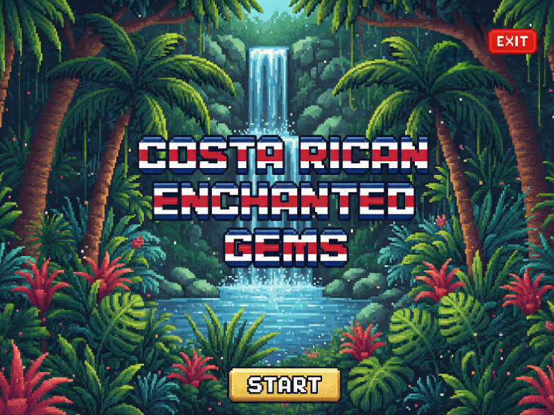

# 🌴 Costa Rican Enchanted Gems

**Costa Rican Enchanted Gems** es un juego tipo **Match-3** inspirado en la exuberante naturaleza tropical de Costa Rica. Desarrollado en **C++20** utilizando la biblioteca gráfica **SFML 2.6.2**, este proyecto académico combina mecánicas clásicas de puzzle con una estética pixel art retro de 16 bits.

> 📚 **Proyecto académico** del curso *Programación 1* – Universidad Nacional (UNA), Campus Brunca, 2025.

---

## 📋 Tabla de Contenidos

- [Características Principales](#-características-principales)
- [Requisitos del Sistema](#️-requisitos-del-sistema)
- [Instalación](#-instalación)
- [Ejecución](#-ejecución)
- [Distribución del Ejecutable](#-distribución-del-ejecutable)
- [Estructura del Proyecto](#️-estructura-del-proyecto)
- [Arquitectura](#️-arquitectura)
- [Mecánicas de Juego](#-mecánicas-de-juego)
- [Sistema de Niveles](#-sistema-de-niveles)
- [Capturas de Pantalla](#️-capturas-de-pantalla)
- [Contribuciones](#-contribuciones)
- [Autor](#-autor)
- [Licencia](#-licencia)
- [Agradecimientos](#-agradecimientos)
- [Notas Adicionales](#-notas-adicionales)

---

## 🎮 Características Principales

- ✨ **Tablero dinámico 8×8** con detección automática de combinaciones (Match-3)
- 🎯 **Sistema de niveles progresivos** con objetivos variados:
  - Recolección de gemas específicas
  - Superación de obstáculos
  - Alcance de puntuaciones objetivo
- 🏗️ **Arquitectura orientada a objetos** con clases especializadas:
  - `Game`, `Board`, `Gem`, `Player`, `UIManager`, `UXManager`, `ResourceManager`
- 🎨 **Estilo visual pixel art retro** inspirado en escenarios tropicales costarricenses
- 💾 **Persistencia de datos** mediante archivos `.txt` en directorio `/saves`
- 📦 **Código portable** sin dependencias de rutas absolutas
- ⚡ **Animaciones fluidas** para movimientos y combinaciones

---

## ⚙️ Requisitos del Sistema

### Sistema Operativo
- Windows 10 o 11 (x64)

### Herramientas de Desarrollo
- **Visual Studio 2022** con compilador MSVC
- Configuración recomendada: `Release | x64`

### Requisitos de Hardware (Mínimos)
- **Procesador:** Intel Core i3 o equivalente
- **RAM:** 2 GB
- **Gráficos:** Tarjeta gráfica compatible con OpenGL 2.0
- **Espacio en disco:** 100 MB

### Dependencias
✅ **SFML 2.6.2** está incluido en `/external/` — no requiere instalación adicional

---

## 🚀 Instalación

### 1. Clonar el repositorio

```bash
git clone https://github.com/JohanDanilo/Match3_Game_JohanSerrano.git
cd Match3_Game_JohanSerrano
```

### 2. Abrir la solución en Visual Studio

```
Match3_Game_JohanSerrano.sln
```

### 3. Configurar el proyecto

Selecciona la configuración:

```
Release | x64

```

### 4. Compilar

- **Menú:** `Compilar → Compilar solución`
- **Atajo:** `Ctrl + Shift + B`

---

## 🎯 Ejecución

### Desde Visual Studio

1. Presiona `Ctrl + F5` o selecciona **Depurar → Iniciar sin depurar**

### Directamente desde el ejecutable

```
x64/Release/main.exe
```

---

## 📦 Distribución del Ejecutable

Para ejecutar el juego en otra PC sin Visual Studio, copia la carpeta completa:

```
x64/Release/
```

> 💡 **Nota:** El juego es completamente portable y no requiere instalación de librerías adicionales.

---

## 🗂️ Estructura del Proyecto


```
Match3_Game_JohanSerrano/
├── external/
│   └── SFML-2.6.2/        # include / lib / bin
├── assets/
│   ├── data/              # Configuración de niveles (levels.txt, etc.)
│   ├── spritesheet.png
│   ├── background.png
│   ├── mainMenu.png
│   └── fonts/
│       └── retro_game.ttf
├── saves/
│   └── player_data.txt
├── src/
│   ├── Game.cpp/.h
│   ├── Board.cpp/.h
│   ├── Gem.cpp/.h
│   ├── Level.cpp/.h
│   ├── LevelManager.cpp/.h
│   ├── Objective.cpp/.h
│   ├── Obstacle.cpp/.h
│   ├── ResourceManager.cpp/.h
│   ├── UIManager.cpp/.h
│   ├── UXManager.cpp/.h
│   └── main.cpp
├── docs/
│   ├── UML_Diagram.png
│   └── Technical_Report.pdf
└── README.md

```

---

## 🏗️ Arquitectura

El proyecto sigue principios de **Programación Orientada a Objetos** con una clara separación de responsabilidades:

### Clases Principales

| Clase                     | Función                                                       |
| ------------------------- | ------------------------------------------------------------- |
| **Game**                  | Controla el ciclo principal del juego y las escenas.          |
| **Board**                 | Maneja el tablero 8×8, detección de combinaciones y gravedad. |
| **Gem**                   | Representa cada gema (posición, tipo, animación).             |
| **Level / LevelManager**  | Gestionan los niveles, objetivos y progresión.                |
| **Objective**             | Define el tipo de objetivo (Collect, ClearObstacles, Score).  |
| **Obstacle**              | Representa elementos bloqueantes (rocas, hielo, etc.).        |
| **ResourceManager**       | Carga texturas, fuentes y sonidos (Singleton).                |
| **UIManager / UXManager** | Controlan la interfaz visual y efectos de usuario.            |


## Patrones utilizados

- **Singleton:** ResourceManager

- **State / Scene Management:** Game coordina escenas (Inicio, Nivel, GameOver).

- **Composición y herencia:** Gem base y gemas especiales (BombGem, IceGem).

---

## 🎲 Mecánicas de Juego

### Reglas Básicas

Intercambia dos gemas adyacentes (↑ ↓ ← →).

Forma combinaciones de 3 o más gemas iguales para eliminarlas.

Las gemas caen por gravedad y generan nuevas combinaciones.

Ciertos niveles incluyen obstáculos que deben eliminarse con combinaciones adyacentes.

Cumple el objetivo del nivel (recolectar, puntuar o limpiar) antes de agotar los movimientos.

Al completar un nivel, se desbloquea el siguiente en el mapa de progreso.

---

## 🎯 Sistema de Niveles

### Tipos de Objetivos

1. **Recolección:** Recoge un número específico de gemas de ciertos tipos
2. **Puntuación:** Alcanza una puntuación mínima
3. **Obstáculos:** Elimina todos los obstáculos del tablero

## 🖼️ Capturas de Pantalla

### Menú Principal


### Mapa de Niveles
> 📝 Agrega captura: `docs/screenshots/level_map.png`

### Juego en Acción
> 📝 Agrega captura: `docs/screenshots/gameplay.png`

### Pantalla de Victoria
> 📝 Agrega captura: `docs/screenshots/victory_screen.png`

---

## 🤝 Contribuciones

Este es un proyecto académico, por lo que no se aceptan contribuciones externas. Sin embargo, cualquier feedback o sugerencia es bienvenido.

### Reporte de Bugs

Si encuentras algún error:
1. Verifica que estés usando la última versión
2. Abre un issue en GitHub describiendo:
   - Pasos para reproducir el error
   - Comportamiento esperado vs. observado
   - Capturas de pantalla (si aplica)

---

## 👨‍💻 Autor

**Johan Serrano Víctor**

- 🎓 Estudiante de Ingeniería en Sistemas de Información
- 🏛️ Universidad Nacional (UNA), Campus Brunca
- 🐙 GitHub: [@JohanDanilo](https://github.com/JohanDanilo)

---

## 📄 Licencia

Este proyecto es de carácter **académico** y fue desarrollado como parte del curso *Programación 1* (2025) en la Universidad Nacional de Costa Rica.

**Restricciones:**

- ✅ Uso con fines educativos
- ✅ Modificación para aprendizaje personal
- ❌ Uso comercial
- ❌ Distribución sin atribución

---

## 🙏 Agradecimientos

- **Universidad Nacional (UNA)** - Campus Brunca, por el apoyo académico
- **Al Profesor Rubén Mora**, por la guía y enseñanza
- **Comunidad de SFML**, por la excelente documentación y ejemplos
- **Laurent Gomila**, creador de SFML
- Inspiración en la biodiversidad de **Costa Rica** 🇨🇷

---

## 📌 Notas Adicionales

### Tecnologías Utilizadas

- **Lenguaje:** C++20
- **Biblioteca Gráfica:** SFML 2.6.2
- **IDE:** Visual Studio 2022
- **Control de Versiones:** Git
- **Documentación:** Markdown

### Recursos Externos

- Sprites originales creados para el proyecto

---

**🌴 Desarrollado con pasión en Costa Rica 🇨🇷**

⭐ Si este proyecto te fue útil, considera darle una estrella en GitHub

[](https://github.com/JohanDanilo/Match3_Game_JohanSerrano)
